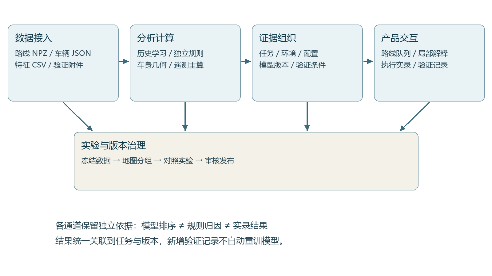
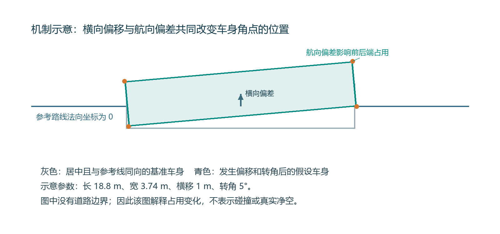
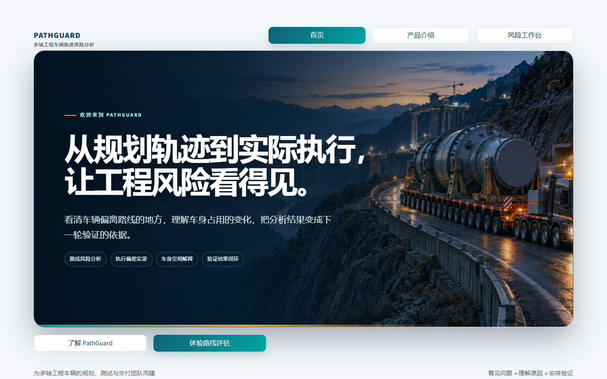
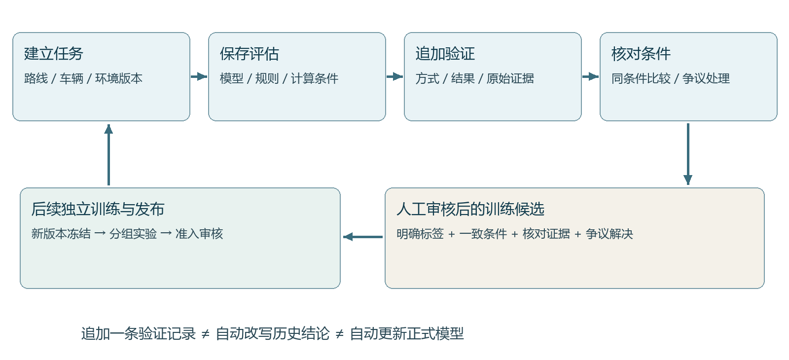
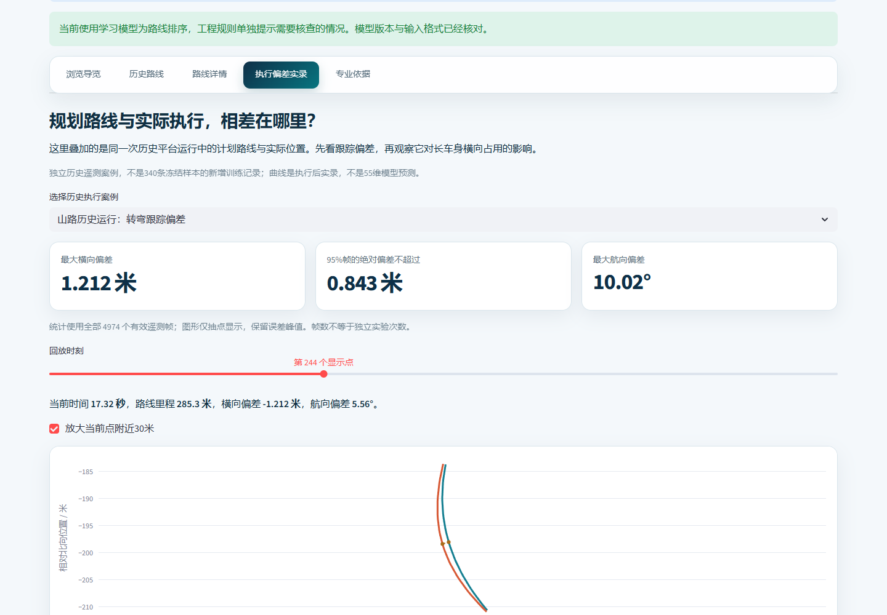

# PathGuard 多轴工程车辆轨迹风险分析与验证决策平台

融合历史学习 车身几何与执行证据的轨迹评估方法

第十五届中国创新创业大赛 AI与工程机械专业赛 项目书

版本 V4　2026年9月

## 执行摘要

工程车辆智能化正从“能够生成路线”走向“能够证明路线在具体条件下值得执行”。一条在地图上可行的轨迹，在闭环运行时仍可能出现横向偏移、航向偏差以及车头车尾占用范围扩大。对于多轴、长车身车辆，中心线是否经过障碍物并不能完整回答车身是否保有足够余量；某一轮平台测试完成，也不能自动解释更换车辆尺寸、环境版本或控制条件后会发生什么。规划工程师、测试工程师和项目交付人员需要共同回答的，是风险出现在哪里、由什么证据支持，以及下一轮验证应优先解决什么问题。

PathGuard面向这一工程环节，建设多轴工程车辆轨迹风险分析与验证决策平台。平台把执行前的路线分析、执行后的偏差实录、车身空间敏感性和验证结果管理组织为统一工作流。用户可以导入新的工程路线文件和车辆配置，生成历史学习排序与独立工程关注提示；可以在路线详情中定位局部路段、观察车身扫掠与条件性边界余量；也可以核对历史平台运行中的计划轨迹与实际轨迹，并把后续仿真、测试平台或现场结果回接到具体任务，形成可复核的工程记录。

项目的技术路线由四部分组成。第一，建立可追溯的数据处理与特征契约，将历史文件转化为结构化监督样本。第二，利用直方图梯度提升树学习执行前特征与历史失败结果之间的关联，同时保留基于开发集经验分布的工程规则，避免把模型分数当作唯一判断。第三，从原始遥测重算横向和航向误差，通过刚性车身几何解释执行偏差如何影响横向空间占用。第四，以任务、环境版本、车辆配置和验证证据为主线管理结果，使不一致结论能够被保留、定位和复核。

当前已经形成可运行的一体化产品、冻结模型、路线导入接口、动态空间视图、执行偏差实录和验证记录导出能力。冻结监督集包含340条样本、25张地图和55项执行前特征；历史独立地图留出实验包含66条样本，其中39条失败，模型前20位包含17条失败，作为该历史留出集合的回顾性排序结果。另对两次独立历史平台运行完成原始路线哈希、遥测和回放核对，共覆盖8202帧记录；重算最大横向偏差分别为1.212米和0.408米，为“计划轨迹与实际执行之间存在可量化差距”提供直接案例证据。

PathGuard的创新价值集中在工程问题组织和可解释的产品闭环：把抽象风险分数转化为具体路线位置、执行偏差、车辆占用和下一步验证动作。项目以轻量软件作为切入点，能够在现有规划器与仿真测试流程之间部署，减少重新搭建整套自动驾驶系统的成本。当前成果定位为可复现、可演示、可接入新任务的研究与工程验证原型；下一阶段以真实候选批次试点验证严重风险覆盖、分析时间和证据复用效果，逐步形成面向工程机械研发测试团队的专业软件产品。

**关键词：**多轴工程车辆；轨迹跟踪误差；车身空间占用；风险排序；跨地图验证；工程证据闭环。

## 1 行业背景与工程需求

### 1.1 从自主规划走向执行可信

智能工程车辆通常通过环境感知、定位、规划和控制共同完成任务。感知系统提供周围对象和可通行区域，规划器在约束下生成轨迹，控制器根据车辆状态追踪参考轨迹。公开的Autoware架构和仿真工具将这些环节作为可独立集成与验证的模块[1,2]。这意味着“已经有雷达和规划器”并不意味着研发测试环节已经不需要独立分析：传感器负责获得信息，规划器负责生成方案，而工程人员仍需检查方案在给定车辆、环境和控制条件下的执行表现。

工程机械作业区域常包含狭窄通道、局部坡面、连续转向和边界不规则路段。对长车身多轴车辆而言，相同的参考中心线可能对应不同的车身扫掠范围。横向跟踪偏差改变整车相对参考线的位置，航向偏差使前后端偏离参考方向，两者共同影响局部横向占用。即使车辆参考点保持在通道内，车头或车尾也可能更接近一侧边界。因此，轨迹评估需要从“线是否可行”推进到“给定条件下的车辆如何沿线运动、外廓如何变化、哪些环节需要进一步验证”。

PathGuard把上述问题转化为面向研发测试的分析对象。它既利用执行前路线特征识别需要关注的组合，也保留执行后遥测用于核对真实表现。两类证据在同一界面中建立联系，但不会混为同一预测：历史学习给出优先检查的线索，执行记录描述已经发生的偏差，几何计算解释已知或假设条件下的空间后果。工程人员据此决定调整方案、补充边界信息、开展闭环仿真还是安排现场验证。

### 1.2 工程团队的三类实际困难

第一类困难是判断信息分散。路线文件、车辆配置、平台报告和执行遥测往往分布在不同目录或工具中。一次失败可能有多个指标异常，但结果页只给出通过或失败；工程人员仍需追查对应的路线版本、局部位置和运行条件。缺少统一关联关系时，即使数据量不断增长，也难形成可复用的测试知识。

第二类困难是分析尺度不一致。规划算法关注参考线和代价，测试团队关注碰撞与完成状态，车辆工程师关注外廓和转向约束，交付人员关注是否需要补测。单独给出综合风险分数，不能解释哪一段路线、车辆哪个部位和哪项证据支持建议。把专业指标转化为工程动作，需要清楚区分计划输入、执行结果和条件性推演。

第三类困难是验证资源有限。候选轨迹数量可以很多，但工程师最终重点复核的数量通常有限。用户提供的一份匿名工程反馈建议把人工重点复核控制在Top-10左右，并强调高优先级集合应覆盖不同问题类型、能定位到地图或回放，同时不能漏掉真正严重的问题。该反馈用于形成需求假设与试点指标，不作为已完成客户试用或节时效果证明。

表1 工程困难与平台对应能力

| 工程问题 | 所需信息 | 平台处理 | 用户获得的结果 |
| --- | --- | --- | --- |
| 路线生成后难确定先检查什么 | 同条件候选及执行前特征 | 历史学习排序与独立规则提示 | 本轮验证顺序与关注原因 |
| 看见失败却难定位到路段 | 路线位置及局部指标 | 全程与局部视图关联 | 可以回看的具体区段 |
| 跟踪误差与车身占用脱节 | 计划位置 实际位置 航向 车身尺寸 | 误差重算及条件性外廓分析 | 偏差怎样改变空间占用 |
| 不同平台结果相互矛盾 | 验证方式 环境和版本 | 追加式记录与冲突复核 | 保留差异并安排补证 |
| 数据积累难支撑下一轮训练 | 已核对标签和来源 | 训练候选审核与版本冻结 | 可追溯的模型迭代输入 |

### 1.3 目标用户与使用场景

首要用户是工程车辆规划与测试团队。规划工程师将同一任务的候选文件交给平台，检查局部曲率、计划速度、转向变化及边界信息，明确哪些路线需要优先验证；测试工程师对照平台遥测和失败报告，查看偏差峰值、发生位置和对应条件；项目负责人查看验证进度和待处理争议，安排下一轮测试资源。三类角色共享同一任务，不需要相互转述没有来源的截图或结论。

优先落地场景是多轴车辆在狭窄道路、转弯路段和坡道上的离线验证分析。现有样本与实现适合从研发测试工具切入，而非直接承诺覆盖全部矿区作业、所有车辆动力学或开放道路自动驾驶。长期可通过新增车辆配置、环境接口和验证批次扩展场景，但每个扩展都应有对应的数据与验收记录。

### 1.4 与实时规划系统的协作关系

实时规划系统解决车辆当前如何运动；PathGuard解决候选方案与执行结果如何被工程团队理解、比较和验证。两者的输入节奏、责任和输出对象不同。PathGuard可以消费规划器导出的轨迹文件，也可以消费仿真或测试平台产生的执行记录；其输出是检查线索、局部空间分析和验证任务，而不是转向或制动指令。

这种协作关系给产品提供了明确入口：无需改写客户现有规划控制算法，先通过文件适配器接入既有测试资产，再把分析结果组织成可执行的复核流程。后续若建设在线接口，仍应保留版本、数据质量和结果来源检查，不把离线分析界面直接作为车辆运行控制闭环。

## 2 产品定位与技术创新

### 2.1 产品定义与建设目标

PathGuard是一套多轴工程车辆轨迹风险分析与验证决策平台。其核心价值主张是：从规划轨迹到实际执行，让工程风险看得见。平台将路线、车辆、环境、模型和验证记录连接为同一工程对象，围绕“关注什么、发生在哪、如何验证、结果如何积累”提供连续操作流程。

近期建设目标是完成可复现原型和可使用的单机工作台，以明确的数据契约接入新任务，以分层视图展示路线和执行证据，以版本化记录支撑协作。中期目标是在真实候选批次上验证排序和复核流程是否改善工程效率，并进一步完善车辆与环境覆盖。长期目标是形成可嵌入研发测试流程的工具组件，使每次仿真或现场验证都成为可复用的工程知识。

### 2.2 创新点一 以执行差距组织轨迹分析

本项目把规划可行性与实际执行表现之间的差距作为统一问题入口。传统结果查看容易停留在通过失败或单项误差曲线上，而PathGuard把执行前路线统计、执行后偏差和车身外廓放在同一分析框架中。用户可以先看到“计划与实际在哪里分开”，再理解横向偏移和航向偏差对前后端空间占用的影响，最后决定需要检查控制跟踪、车辆配置还是环境语义。

该创新体现在分析组织和交互机制：让同一工程问题跨越数据、算法、几何和验证记录。它不依赖发明新的通用分类器，也不把几何敏感性包装成高保真车辆仿真；通过明确各模块的对象和依据，平台把已有理论方法转化为可操作的工程分析能力。

### 2.3 创新点二 历史学习与工程证据协同

系统采用历史学习、固定工程规则和空间计算三条互补分析通道。学习模型发现多个执行前特征与历史失败结果的统计关联；规则通道保留曲率、速度耦合、转向、坡度和余量等工程含义；空间通道在输入条件允许时计算车身相对路线和边界的位置。用户既能得到排序入口，也能独立核对局部指标，不需要把模型分数解释为已经证实的风险原因。

这里的协同是系统级证据组织，并非把所有结果加权成一个“万能风险值”。模型在不同预算下与规则各有表现，产品因此保留独立通道，使后续能够根据真实批次实验决定是否引入校准后的融合策略。这样的架构也便于更换模型、更新边界接口或接入新的测试平台。

### 2.4 创新点三 证据条件驱动的结果分层

平台根据证据条件决定输出深度。只有路线时，可呈现轨迹、局部几何与历史模型排序；具有完整边界和有效车辆配置时，才进一步输出条件性空间余量；具备原始执行遥测时，展示实际偏差实录；具备同条件验证结论时，再形成结果比较和训练候选。数据不足被表达为具体缺失项，工程人员可以知道下一步补什么，而非收到没有解释的统一高风险提示。

这使“证据不足”和“已观察到危险现象”保持区别。未知车型不会被静默认作六轴，假设尺寸不会自动写入正式车型配置，某个地图边界字段也不会仅凭名称被解释为车体净空。分层规则提高了数据利用率：大部分记录可以用于路线和指标展示，少部分证据完整记录用于更深入的空间分析。

### 2.5 创新点四 从验证反馈形成可治理的数据闭环

平台将新任务、分析快照、验证记录和候选训练数据连接起来。输入时记录路线和环境版本，分析时保留模型与特征契约标识，验证时登记方式、条件、结论和附件，发现同条件矛盾时保留争议并要求复核。训练候选需经过人工审核，后续以新版本数据集和独立测试开展模型更新。

这一设计针对工程数据长期难复用的问题：不是简单地把用户点击“失败”当成新标签，而是先判断结果是否对应同一条路线、同一条件和可信证据。随着真实任务积累，平台能够支持更可靠的批次比较、错误分析和模型改进，为商业化软件持续演进提供基础。

表2 技术贡献与现阶段承载方式

| 贡献方向 | 方法机制 | 已有载体 | 主要工程价值 |
| --- | --- | --- | --- |
| 执行差距解释 | 计划和实际对齐 误差重算 | 两次核对运行与交互页面 | 从结果回到具体位置与偏差 |
| 多证据协同 | 学习排序 规则提示 空间分析分离 | 冻结模型与统一工作台 | 避免单一黑箱分数主导复核 |
| 条件化分析 | 依据车辆和边界完整度分层 | 边界筛查与假设状态标注 | 信息可用到什么程度说得清楚 |
| 验证数据治理 | 版本关联 追加记录 冲突处理 | 本地任务库与导出包 | 让后续结果成为可复用资产 |

## 3 系统总体架构与工作流程

### 3.1 五层架构

系统由数据接入层、分析计算层、证据组织层、产品交互层和实验治理层构成。数据接入层负责NPZ路线、车辆JSON配置、特征CSV和验证附件；分析计算层负责55维特征提取、冻结模型推断、独立工程规则以及车身几何计算；证据组织层把每条结果关联到任务和版本；产品交互层提供路线队列、局部解释、执行偏差实录和结果录入；实验治理层保存冻结清单、地图划分、历史预测和对照结果。

图1 PathGuard系统架构与数据流

分析计算与展示分离，使前端视觉迭代不必重新训练模型。证据组织与模型分离，使新增验证记录不会自动改变历史预测。实验治理层与历史案例浏览分离，使用户不会把部署模型对训练样本的重新评分误认为独立测试成绩。这些分离是工程稳定性的基础，也为后续服务化接口提供清楚的模块边界。

### 3.2 一次任务的端到端流程

用户首先建立任务，填写场景名称和环境版本，上传同一条件下的候选路线及车辆配置。系统逐个检查文件和特征字段，对缺失或异常数据给出明确提示；通过校验的输入保留原始文件及哈希，形成任务快照。随后运行学习模型与工程规则，生成候选路线列表和局部关注信息。

用户进入路线详情后，可在全程与局部视图之间定位关注路段。车身空间分析根据有效尺寸和边界检查状态输出相应结果；若使用假设尺寸，则明确表示参数敏感性试算。对于已有执行证据的案例，用户能够对照实际和计划轨迹，查看误差随行程的变化。完成新的仿真或测试后，用户追加验证方式、结果和依据，并核对是否与原任务条件一致。

最后，平台将文件、配置、评估快照、验证记录和附件导出为任务包。研发同事可以据此复现分析，测试同事可以核对条件，项目负责人可以确认哪些结论已得到验证、哪些仍有争议。任务完成不是一个不可追溯的最终分数，而是一组可以继续使用的工程记录。

### 3.3 核心对象与关联关系

表3 系统核心数据对象

| 对象 | 主要内容 | 关联作用 |
| --- | --- | --- |
| 任务 | 名称 场景 环境版本 创建状态 | 定义可比较的工程范围 |
| 候选路线 | 原始文件 文件哈希 提取特征 | 确认评估对象及输入一致性 |
| 车辆配置 | 结构 长宽 参考点及确认状态 | 支撑条件性车身几何计算 |
| 评估快照 | 模型标识 特征契约 得分 工程提示 | 保留当时计算依据 |
| 验证记录 | 方式 条件 结果 严重程度 附件 | 与预测或建议进行核对 |
| 复核结论 | 条件一致性 证据完整性 冲突状态 | 决定是否可进入训练候选 |

追溯编号服务内部关联和查源，在日常页面中使用可读名称、场景和路线长度展示。这样既保留工程可追踪性，也避免用户面对大量哈希字符串而无法判断路线含义。历史案例库按独立记录组织，不会仅因地图相同就自动认定为同一次规划任务的候选集合。

## 4 数据工程与冻结机制

### 4.1 从历史文件到监督样本

项目首先对历史文件进行清点、哈希匹配、可读取性检查和特征提取，再按监督标签与质量条件形成冻结集。当前数据卡记录451条哈希匹配记录、437条成功提取特征记录，最终进入监督模型的是340条样本。不同阶段数量描述不同对象，不能把文件数量、遥测帧数、路线数和监督样本数相加作为训练规模。

最终340条样本覆盖25张地图，其中139条通过、201条失败；结构分布为五轴99条、六轴79条、结构未定162条。结构未定反映现有证据未能完成车型确认，不等于车型不存在。模型使用冻结特征矩阵，车辆结构和样本编号等元数据不直接输入分类器。对于车型相关展示，页面保留未知状态，不用猜测补齐。

表4 当前数据资产及用途

| 数据资产 | 规模 | 主要用途 | 统计单位 |
| --- | --- | --- | --- |
| 冻结监督样本 | 340 | 训练与历史实验 | 样本 |
| 开发部分 | 274 涉及20张地图 | 模型比较与规则参考 | 样本及地图 |
| 独立地图留出 | 66 涉及5张地图 | 历史泛化评估 | 样本及地图 |
| 通过原始核对的执行记录 | 2次 共8202帧 | 执行偏差案例分析 | 独立运行及其帧 |
| 具有完整左右边界坐标 | 69 | 边界进一步审计 | 冻结样本 |
| 通过完整点列筛查 | 3 | 条件性空间分析 | 五轴样本 |

### 4.2 数据去重与来源追溯

去重的目的在于避免同一文件被复制到不同备份目录后反复计入成果。文件哈希用于识别字节一致的对象；路线与报告之间的关联用于区分同路线新报告和真正不同输入。对原始文件的读取、关键数组形状和提取结果进行检查，能够及时发现损坏、缺失或语义不一致的记录。

冻结清单保留样本身份和文件关联，使模型指标可以追溯到对应输入。对于后续恢复的执行遥测，除了文件哈希，还核对回放数据和原始遥测通道是否一致。本轮核对发现的重复备份不计为新运行，通道不一致的案例未进入实录证据。这种管理方式让项目积累的并非越来越大的文件夹，而是含义清楚、可以复查的数据资产。

### 4.3 特征契约与输入一致性

执行前特征契约固定为55项，覆盖路线几何、坡度、计划速度及其与曲率的耦合、转向、航向变化、静态余量和局部窗口统计。特征版本为pathguard_preexec_v2.0.0，局部窗口以10米为统计尺度。模型推断时检查列名、版本、字段数量和数值有限性，缺列或不兼容输入不会通过静默补零掩盖。

模型使用执行前可获得的信息，不将最终通过失败结果作为输入。样本编号、地图编号和车辆结构文字用于追溯与筛选，不进入模型特征矩阵。计划速度与实际速度是不同信息，在设计执行前预测任务时必须保持区别；不能用运行后才能看到的真实速度或跟踪误差解释执行前成绩。

55是每条样本的特征数量，340是监督样本数量，二者分别对应表格的列与行。原始路线本身可能含有数百或数千个点，特征提取将点列压缩成可用于小样本模型的统计描述，动态可视化则保留路线坐标资产。模型训练规模、路线几何分辨率和运行遥测长度因此是三个不同维度。

### 4.4 地图隔离与版本冻结

同一地图中的路线常共享几何和环境特征，若随机把相近记录分入训练与测试，可能高估陌生地图上的表现。项目采用地图分组方法，开发集中的模型比较使用GroupKFold，历史留出部分保留5张独立地图[3]。这种划分比逐条随机划分更贴近“新地图是否仍可用”的工程问题，但并不能代替全新客户任务验证。

部署模型与实验模型采用不同用途的版本记录。历史独立留出结果来自当时保存的预测；当前前端所用模型在全部340条样本上重训，用于演示与新输入评估。历史样本在前端被重新评分时，页面的输出属于产品工作流展示，不再次作为泛化证明。该机制支持产品持续运行，同时保留实验成绩的原始来源。

## 5 历史学习模型与工程规则

### 5.1 学习任务的数学定义

对第i条路线，以执行前可提取的55维向量x_i表示输入，以历史验证标签y_i表示结果，标签约定为0对应失败、1对应通过。模型学习特征和历史失败结果之间的统计关联，输出失败类别的预测分值r_i=f(x_i)。在一个候选集合中，按r_i降序形成优先检查顺序。

式1　x_i ∈ R⁵⁵，y_i ∈ {0,1}，r_i = P̂(y_i=0 | x_i)。

这里的P̂是分类器输出形式，不代表经过外部校准的实际碰撞概率。历史失败标签可能包含完成条件、指标阈值或特定平台检查结果，不能直接映射为统一事故事件。因此，产品采用“模型排序分值”表达其用途，并通过独立指标解释、后续验证记录和实验对照判断该分值是否具有任务价值。

### 5.2 采用直方图梯度提升树的原因

冻结模型采用HistGradientBoostingClassifier。梯度提升树通过逐步加入树模型拟合当前损失的改进方向，直方图方法将连续特征分箱以组织候选切分[4]。对于现阶段规模有限、结构明确的表格特征，它提供了无需大规模深度网络训练的实现路径，也便于CPU本地运行和完整保存推断工件。

选择该模型不是因为模型名称更复杂，而是因为开发集比较提供了依据：地图分组五折中，直方图梯度提升树失败类别PR指标均值为0.6605，ExtraTrees为0.6349，逻辑回归为0.6157。该比较支持其作为现阶段冻结基线，同时折间波动提示需要继续扩展独立地图与真实任务。项目的技术价值也因此不押注单一算法，而是保留可替换模型接口和一致的评价协议。

### 5.3 工程规则的独立作用

工程规则将相关应力或约束指标与274条开发样本的固定经验分布比较，形成可解释的相对关注信号。计划速度与曲率组合偏高，提示需要核对转弯跟踪表现；转向变化偏大，提示需要关注控制响应；余量偏小，提示进一步核对边界和车辆外廓。规则所用参考分布固定，不随用户本次上传的候选数量改变，避免同一路线在不同上传批次中被重新定义风险水平。

规则输出的意义是“相对开发样本更值得关注”，不是已经证明违反某条车辆安全标准。实际可接受阈值需要结合具体车辆、工况和测试规范。界面的工程原因也属于规则提示，不等于学习模型内部归因，更不能仅凭相关指标确认控制器或感知系统故障。

### 5.4 排序与复核动作的关系

排序用于组织有限验证名额，而不是把低分路线自动标记为安全。用户可以选择本轮优先查看的数量，其余候选仍按工程计划验证。已确认的边界异常或关键输入问题需要作为独立事项处理，不被排序预算压下去；使用假设尺寸得到的试算结果，则作为探索性提示，不自动登记为真实任务结论。

一个合理的产品流程应区分三件事：路线排序、已观察到的问题和证据待补事项。排序靠前表示模型认为值得先看；指标异常表示某项工程证据需要核对；证据不足表示计算条件尚未满足。把三者一律变为“高风险必须人工复核”会使平台失去优先级价值，因此前端采用具体动作和条件提示组织工作。

### 5.5 模型迭代的准入条件

模型升级需在冻结数据、划分和指标口径下与现有模型及规则对照。优先关注严重失败漏检、相同验证预算下的失败捕获和陌生地图稳定性；整体PR或ROC改善只是其中一部分。新增空间特征必须有可靠边界、车辆参数与同条件验证标签，不能用几何公式生成标签再用同类几何特征训练模型，随后把拟合公式的结果当作工程泛化。

同一路线的尺寸变体和同一次测试的派生记录，应放在同一训练或测试组中。数据量不足时，保留新方法为影子实验，正式产品继续使用已冻结版本。这样能让探索速度和对外稳定性兼容，并为团队协作提供明确的接入标准。

## 6 执行偏差与车身空间机制

### 6.1 从轨迹参考点到实际运动

设参考路线在里程s处的位置为p_ref(s)，参考航向为ψ_ref(s)，平台实际位置为p_act，实际航向为ψ_act。将位置差投影到参考路线的法向方向，可以得到横向偏差；对航向差进行角度环绕处理，可得到航向偏差。两者分别描述车辆参考点偏离路线的程度，以及车身朝向偏离参考方向的程度。

式2　e_y = (p_act − p_ref) · [−sin ψ_ref, cos ψ_ref]。

式3　e_ψ = wrap(ψ_act − ψ_ref)。

重算前必须确认参考坐标、里程和遥测通道的对应关系。车辆在回退、特殊机动或轨迹重定位时，不能仅按最接近的坐标点假设映射正确。本项目使用记录的里程进度进行参考插值，并与原始记录误差比较；回放和遥测进度通道不一致的案例被排除，避免漂亮的重合图掩盖数据配对错误。

### 6.2 横向与航向偏差怎样影响长车身

在局部参考线坐标系内，设车身某角点相对车辆参考点的位置为(x_c,y_c)。当车辆存在横向偏差e_y和航向偏差e_ψ时，该角点的法向坐标为：

式4　n_c = e_y + x_c sin(e_ψ) + y_c cos(e_ψ)。

对车身四角分别计算n_c，即可得到局部横向占用区间。以居中、无航向偏差的基准车身半宽W/2为参照，额外占用可表示为max(max n_c − W/2，−min n_c − W/2，0)。该计算解释了为什么同样的航向偏差对长车身的前后端更敏感，也解释了只看中心线误差无法完整描述车辆占用范围。

例如，在参考点居中的刚性矩形假设下，长度18.8米对应前后端纵向距离9.4米。若航向偏差为5度，仅x_c sin(e_ψ)一项就约为0.82米。这个数值是几何机制示例，不是某条道路真实损失的净空；真实边界余量还需确认边界坐标、车辆参考点、车身形状和环境条件。例子的价值在于让用户直观看到长车身如何放大姿态偏差的空间影响。

图2 跟踪偏差影响车身横向占用的局部几何示意

### 6.3 空间分析的输入与结果层次

车身扫掠可由逐点位置、航向角和车辆尺寸计算，表示车辆按给定姿态序列运动时覆盖的平面区域。它回答“在这些假设下车身到过哪里”，并不单独回答“是否碰撞”。碰撞或越界判断还需要可信障碍物或边界，以及与路线一致的坐标系和采样质量。

当前产品支持刚性矩形外廓及参考点设置，可展示四角运动和局部空间关系。当左右边界数据通过距离语义、方向、次序和连续性筛查时，平台能够提供条件性的余量试算；当边界不足时，仍可展示路线及车身扫掠，但不输出有实证含义的道路净空结论。历史默认尺寸明确标记为假设值，用户调整长宽改变的是几何结果，不会改变现有55维模型的排序分值。

质量或重量没有进入现有几何或学习计算，因此产品已移除没有解释作用的质量输入。若未来考虑载荷对制动、轮胎附着或控制响应的影响，必须接入对应动力学模型和标签。让每一个可调参数对应清楚的计算链路，是平台可解释性的组成部分。

### 6.4 可信环境约束如何接入

可信环境约束需要包含几何、语义和版本三个部分。几何部分提供左右边界、障碍物多边形或其他可计算对象；语义部分说明对象是可行驶边界、实体障碍还是平台规则线，以及距离字段测量的是中心线还是车身外廓；版本部分说明坐标系、单位、测绘时间和适用场景。

接入流程应先检查有限数值、点列顺序和坐标一致性，再检查边界相对路线的左右方向、连续性和局部交叉，最后确认车辆尺寸与参考点配置。通过这些检查后，在给定路段和采样尺度下计算车身与环境对象的关系。若环境更新，应生成新的评估版本，而不是沿用旧结果。

当前冻结数据中69条带完整左右边界坐标，26条通过距离语义检查，3条通过完整点列筛查，均为五轴。这里的筛查是进一步分析的准入条件，不是连续碰撞检测完整性证明。平台把边界完整度作为可见状态，是为了让输入文件中的数字获得明确工程含义，而不是人为限制所有数据的展示用途。

### 6.5 原跟踪响应模型的研究定位

项目早期探索过根据速度、曲率、变化率和坡度等条件建立经验响应表，以估计未来约1秒窗口中的横向和航向偏差。该研究与当前执行差距主线相关，但它与Gate 3的历史失败分类模型是两个不同任务。前者面对时序响应，后者面对路线级历史结果，数据单位、输入时点和评价指标都不同。

本轮对原响应表重新开展整图留出复验，地图宏平均横向中位预测绝对误差约0.145米，名为P95的输出覆盖约82.8%，支持域标记比例约64.4%。这些结果说明时序偏差预测值得继续研究，但尚不能把P95名称解释为保证95%覆盖，也不能据此为陌生地图提供稳定的时序风险预测。因此当前产品展示实际执行偏差，并将响应表保留在研究分支。

## 7 产品交互与验证闭环

### 7.1 从客户问题进入产品

首页用完整主视觉和简洁价值主张建立产品认知，不在首屏展示大量研发统计。产品介绍回答规划之后为什么还需要分析、平台可以看见什么、工程师如何行动。风险工作台承载实际操作，避免产品故事和模型审计混排在同一层级。

工作台支持体验历史路线、新建评估任务和打开已保存任务。历史入口用于理解功能；新任务入口用于导入用户自己的路线和车辆配置；已保存任务用于继续核对和追加验证。客户首先看到可读路线名、场景、建议和位置，追溯编号、模型版本和输入字段放在按需展开的技术区。

图3 产品首页与客户入口

### 7.2 路线队列与详情解释

路线队列提供车辆结构、来源和名称筛选，以及模型排序和工程提示。列表中的“本轮优先验证”是工作安排，不等于平台直接批准其他路线通行。详情页把建议动作放在上方，再显示动态车身示意、全程与局部位置关系、关注区段和指标解释。专业字段保留单位、统计口径和计算来源，避免只显示不容易理解的缩写。

全程图表示输入文件中的全部坐标点，局部动画显示其中选定区段；局部区段不是另外训练出的独立路线。当前340条冻结记录都具有路线可视化资产，15条讲解示例只是快速体验入口，不代表只支持15条数据。用户上传的新路线也可经统一解析流程进入分析，不局限于选择已有案例。

### 7.3 执行偏差实录

执行偏差页以真实历史平台运行作为讲解入口。用户选择案例后，查看计划与实际位置的叠加、误差随里程变化、当前帧数值和车身空间敏感性。页面区分“核对后的遥测结果”和“假设尺寸下的几何推演”，使观看者知道哪部分来自实际记录，哪部分来自可调条件。

在山路案例中，用户可直接定位较大的横向偏差并观察计划与实际轨迹的分离；在坡道案例中，可以比较另一组误差分布，而不是仅展示一个最极端点。原始平台检查结果单独保留，让工程人员看到“完成”“碰撞状态”和“边界检查”可能不是同一判断维度。

### 7.4 多来源验证与不一致结果处理

用户可以在创建任务时选择待评估或已有验证记录。后续每次验证单独登记来源，例如闭环仿真、其他测试平台、实车或现场测试、人工复核；同时保存环境版本、路线版本、车辆有效尺寸、结论和严重程度。验证方式本身不是自动可信度排名，关键是条件是否对应、数据是否完整以及是否经过核对。

如果平台评估分值高而仿真通过，系统不把两者立即认定为冲突，因为排序线索与验证结果的语义不同。如果两次同条件验证分别给出通过和失败，则保留两条记录并进入争议复核；若车辆尺寸或场景版本已经变化，则作为不同条件的结果比较。处理过程中不删除不利记录，也不以最后一次结果自动覆盖前一次。

图4 验证记录与数据治理闭环

### 7.5 训练候选与任务级评估

新验证记录默认不直接进入训练。只有结论明确、输入条件一致、证据经过核对且无未解决的同条件矛盾时，才可被人工标记为训练候选。候选数据经过后续冻结、分组和独立评估后，才可能形成下一版模型。这个流程让“数据回流”成为治理机制，而不是界面上一个未经控制的自动学习开关。

平台也支持在本任务具有足够已核对结果后，描述性地计算Top-K失败捕获和严重失败漏检。当前最低展示条件为至少5条有效候选、至少2条失败并存在通过样本；该条件用于避免明显不成立的展示，不是统计充分性标准。如果只验证排名靠前的路线，仍会产生选择偏差，试点需覆盖预算外样本或采用完整验证设计。

## 8 实验设计与量化结果

### 8.1 评价问题与指标解释

实验需要分别回答三个问题：执行前特征能否提供历史失败排序信息，规则与学习在相同集合上如何比较，以及真实执行偏差能否被准确定位与解释。不同问题不能用同一个准确率替代。路线级模型使用PR和ROC指标及Top-K捕获；执行偏差使用米和角度误差；空间分析使用给定假设下的几何关系；产品试点再评价工程时间、证据完整度和严重问题覆盖。

Top-K精度表示排名前K条中失败所占比例，失败捕获率表示全部失败中有多少进入前K。二者分母不同。例如，前20条发现17条失败意味着该Top-20的失败比例为85%，但在39条总失败中只覆盖43.6%，不能改写为“系统准确率85%”或“风险识别率85%”。项目在指标表中同时给出样本和失败总数。

### 8.2 历史独立地图留出结果

表5 历史留出集合上的同口径比较

| 方法 | ROC指标 | PR指标 | 前10位失败数 | 前20位失败数 | 前34位失败数 |
| --- | --- | --- | --- | --- | --- |
| 冻结学习模型 | 0.6149 | 0.6994 | 8 | 17 | 24 |
| 固定工程规则 | 0.6534 | 0.7116 | 8 | 15 | 27 |
| 最小余量排序 | 0.5603 | 0.6471 | 8 | 10 | 22 |
| 事后等权混合研究对照 | 0.6496 | 0.7197 | 8 | 17 | 27 |
| 随机选择期望 | — | — | 5.91 | 11.82 | 20.09 |

表5使用同一历史留出集合，共66条样本、5张地图、39条失败。学习模型前20位包含17条失败，相比随机选择的期望11.82条多约5.18条，相比最小余量排序多7条，展示了多个执行前特征用于历史失败筛查的价值。在前10位时学习模型与规则均为8条；在更大的前34位预算下，规则为27条、模型为24条，说明算法优劣随评价目标和预算变化。

项目据此采取更有工程弹性的产品设计：保留学习排序，也保留独立规则；把排序作为检查入口，把指标和验证证据作为后续判断基础。事后等权混合只用于研究对照，没有成为正式产品风险算法。该留出集合包含不同地图和条件，结果不能直接外推为真实单次任务的节时比例或批次挑选收益。

### 8.3 特征组消融与简化方向

表6 开发集地图分组五折特征消融

| 设置 | 特征数 | 失败PR均值 | 相对完整特征变化 |
| --- | --- | --- | --- |
| 完整特征 | 55 | 0.6605 | 基准 |
| 去掉路线几何组 | 40 | 0.6734 | +0.0129 |
| 去掉坡度组 | 48 | 0.6849 | +0.0244 |
| 去掉速度动力学组 | 38 | 0.6691 | +0.0086 |
| 去掉转向组 | 46 | 0.6840 | +0.0234 |
| 去掉余量组 | 50 | 0.6554 | −0.0051 |
| 去掉局部窗口组 | 53 | 0.6801 | +0.0196 |

消融显示，增加特征并非在当前样本规模下持续提高指标。余量组移除后均值下降，其他若干组移除后均值上升，这可能与冗余、地图差异和小样本波动有关。它提示下一阶段应将特征简化、稳定性分析和新地图复验作为研究重点，而不是宣称55项特征均具有独立显著贡献。

保留55维冻结契约的近期理由是工程一致性：前端解析、模型工件和历史实验已经以该版本对齐。新特征选择应在独立开发流程中完成，达到准入标准后发布新版本，避免只因一次消融均值更高就修改全部输入格式。这样既承认实验信息，也保护已完成产品和协作接口。

### 8.4 从跨地图筛查到真实批次优选

当前历史档案缺少可靠的规划运行批次标识。按地图与已确认结构构造的代理分组，仅得到4组、33条样本和27条失败；在各组取20%预算并考虑并列分数后，学习模型捕获5条、规则6条，随机期望6.625条。这一诊断不能证明批次优选收益，也提醒我们不要用跨地图整体排序代替同任务候选比较。

下一阶段需要在导入新任务时保存真实candidate_batch_id或等价任务关系，并在相同车辆、环境和验证方式下获得完整候选结果。该工作不只是补更多路线，而是补齐正确的实验单位。只有在这一基础上，才能验证平台是否帮助工程师在有限名额中更早找到严重问题，以及是否覆盖了不同类型的风险。

### 8.5 空间增强实验的接入判断

已审查的旧空间增强预测文件中，55维基线与空间增强模型逐条分数相同，且存在地图内预测恒定现象，不能据此证明空间特征有效。当前完整边界样本覆盖有限，尚不适合把新的尺寸相关分类模型纳入正式产品。平台因此优先实现可验证的几何交互，使“尺寸改变—空间量改变—位置解释改变”形成明确计算链路。

后续实验应比较学习模型、几何规则和加入空间特征后的模型，并保证同路线不同尺寸版本同组划分。验收重点是未见地图严重失败漏检和Top-K捕获的稳定改善，而非只在训练数据上得到更高分数。如果新增特征不能提供独立收益，保留几何分析作为专业工具，本身仍有产品价值。

## 9 执行案例与工程解释

### 9.1 案例证据如何确认

本轮执行证据从历史平台档案恢复。核对内容包括原始路线与遥测关联哈希、归档清单中文件哈希、原始遥测与回放通道一致性，以及重新计算的误差与记录值的偏差。五份回放档案中，两份属于重复备份，一份存在进度通道不一致，最终采用两次独立运行作为执行偏差实录。

两次运行共8202帧，分别提供连续执行过程，而非8202个独立验证任务。案例支持的是偏差确实发生、可被重算并定位到路线；它们不构成所有地图、车型和载荷的性能统计。保留明确的证据单位，使案例既直观，也能接受专业追问。

### 9.2 山路运行中的转弯跟踪偏差

山路案例mounarea_1包含4974帧。重算横向偏差绝对值最大1.212米，95分位0.843米，最大航向偏差绝对值10.020度。重算横向偏差与原记录之差的95分位约0.0054米，参考位置插值与记录参考点之差的95分位约0.00004米。较小的一致性误差支持当前图像和曲线确实对应原始执行记录。

这个案例最适合展示产品的核心问题：规划路线可以被画出，平台运行也可以完成，但实际参考点并不始终沿计划线运动。用户可定位偏差集中的里程段，再结合车身敏感性观察前后端占用怎样变化。平台输出的是可核对现象和进一步检查方向，而不是仅用一个最高分说“有风险”。

原始平台碰撞状态为clear，文本边界余量约−0.147米，点云余量约1.005米，硬检查未通过的原因为文本净空项。这组差异提示需要核对边界语义与检查条件，不能把负文本余量直接描述为实际碰撞。案例因而同时展示了偏差定位和多来源结果核对两种能力。

图5 已核对山路运行的执行偏差实录界面

### 9.3 坡道运行中的偏差分布

坡道案例ramp_1包含3228帧。重算最大横向偏差绝对值0.408米，95分位0.337米，最大航向偏差绝对值6.266度；重算与记录横向误差之差的95分位约0.0035米。相比只引用山路极值，第二个案例提供了另一组连续分布，使用户看到不同输入与运行条件下，偏差规模和曲线形态可以不同。

该运行平台碰撞状态为clear，文本边界余量约0.548米，点云余量约2.416米，原硬检查通过。平台展示原始结果与重算偏差，说明“存在跟踪误差”与“原平台检查失败”不是等价命题。工程复核需要结合实际可接受余量，而不是认为任何偏差都必须被判成失败。

表7 两次核对运行的执行偏差摘要

| 案例 | 帧数 | 最大横向偏差 | 横向偏差95分位 | 最大航向偏差 | 原平台碰撞状态 |
| --- | --- | --- | --- | --- | --- |
| 山路运行 | 4974 | 1.212米 | 0.843米 | 10.020度 | clear |
| 坡道运行 | 3228 | 0.408米 | 0.337米 | 6.266度 | clear |

### 9.4 从案例形成复核任务

面对偏差集中区段，首先应确认路线与遥测对齐，其次查看计划速度、曲率和航向变化，再核对控制跟踪、车辆参考点与环境版本。若希望判断车头车尾是否接近边界，还需补齐运行绑定的真实车辆配置和可信边界。平台以这样的顺序组织证据，帮助不同专业人员围绕同一问题沟通。

当前用于车身占用敏感性的18.8米长、3.74米宽来源于恢复的六轴配置参考，但尚未证明与两次运行逐一绑定，因此以假设尺寸呈现。滑块改变后，实际轨迹和实录误差不会改变，改变的是该尺寸条件下的外廓解释。区分“观测不变”和“假设推演改变”，使交互具有可说明的工程意义。

## 10 工程实现与部署交付

### 10.1 模块化实现

表8 主要工程模块与职责

| 模块 | 核心职责 | 对产品的支撑 |
| --- | --- | --- |
| demo/app.py | 页面组织和任务交互 | 统一客户入口 |
| demo/route_input.py | 路线解析和特征接入 | 新文件可评估 |
| demo/inference.py | 契约与模型加载校验 | 推断版本一致 |
| demo/rule_baseline.py | 固定开发分布规则 | 独立工程提示 |
| demo/tracking_evidence.py | 遥测实录及几何解释 | 执行差距可见 |
| demo/task_store.py | 任务和快照保存 | 结果可追溯 |
| demo/feedback_store.py | 验证记录与争议处理 | 数据回流可治理 |
| demo/batch_evaluation.py | 同条件任务描述统计 | 试点评估入口 |

当前采用Python与Streamlit建设一体化工作台，浏览器负责交互，本机进程负责计算，冻结模型作为本地工件加载。该方式适合比赛演示和研发团队试用，避免为初次部署引入复杂云架构。模型本身不依赖外部大模型服务，已有分析链路可以在本地数据环境中运行。

### 10.2 运行环境与版本管理

冻结模型使用scikit-learn 1.0.2固化，推荐使用Python 3.10和仓库依赖清单建立独立环境。启动入口为streamlit run demo/app.py。部署包应包含模型、特征契约、演示资产和必要依赖，启动后检查模型状态与输入契约一致性，再进行路线导入和任务保存验证。

当前单机演示不要求租用服务器。若后续需要多用户并发、统一账户、集中数据和远程访问，则应新增服务端权限、备份和并发存储设计，独立验收后再部署。硬件采购或云租赁应由真实工作负载决定，不能用更大的服务器代替数据和方法验证。

### 10.3 测试与质量保证

工程测试覆盖输入契约、模型加载、独立规则、任务保存、反馈状态、几何计算和执行证据。零误差、纯横移、航向正负对称与长度敏感性等几何用例，用于确认参数改变与计算结果一致。界面测试检查主要页面、选择器、模型状态和桌面及移动端布局，使产品叙事变化不会破坏实际操作。

发布时应固定代码提交、模型哈希、特征契约和数据卡，保留测试结果。前端视觉修改不得改变冻结数据口径；实验策略未经准入不得替换正式模型；导出任务包需与页面所展示的路线和版本一致。通过这些措施，团队可以继续优化界面和讲解，同时维持工程结果的稳定性。

### 10.4 对接客户工具链的实施方式

第一阶段采用文件对接，以客户规划器导出的路线、车辆配置和测试平台结果为输入，建立字段映射与坐标说明。第二阶段在确认字段稳定后封装接口，将批次任务、评估结果与验证记录连接到客户现有流程。第三阶段再根据真实需求接入自动化测试调度、历史案例检索或团队级权限管理。

每次对接都应先交付一份输入适配说明和小规模对照报告，确认同一文件在客户工具与PathGuard中的含义一致。这样能够把接口开发、工程验证和产品试用分开验收，减少在早期一次性承诺全部场景的风险，也降低客户首次试用的成本。

## 11 客户需求与拟开展试点

### 11.1 已收集需求的产品转化

目前已收到一份匿名工程反馈。反馈强调，算法内部候选可能较多，但工程师真正需要看的是数量有限、类型有区分、可定位到原因的路线；最耗时的工作还包括可信场景构建、失败案例排查以及仿真与现场差异核对。团队据此把产品重点放在位置解释、条件确认、结果回放和验证闭环，而非只展示训练样本数量。

这份材料属于需求输入，尚未构成实名专家背书或企业试点验收。产品书保留其对需求设计的作用，同时用后续试点获取可量化证据。对企业或工程人员的合作名称、身份和使用评价，按真实获得的材料记录，不以拟开展方案替代已完成合作。

### 11.2 拟开展的试点范围

建议首轮选择一个明确车型配置和一个稳定环境版本，在狭窄转弯或坡道路段构建若干真实规划任务。每个任务保存完整候选批次关系，并对候选的仿真或测试结果采用统一检查规则。任务数量以客户可提供的数据为准，首先保证批次和标签正确，再逐步增加规模。

试点分为接入核对、盲化分析、结果核对和复盘四步。接入核对确认单位、坐标、车辆参数及环境对象；盲化分析在不读取最终标签的条件下保存模型和规则排序；结果核对由测试人员按统一条件完成验证；复盘比较相同预算下发现的问题和遗漏，并记录工程师实际操作时间。

### 11.3 试点指标与验收设计

表9 拟开展试点的评价框架

| 评价问题 | 指标或记录 | 对照方式 | 通过条件的确定 |
| --- | --- | --- | --- |
| 是否更早找到严重问题 | 严重失败漏检及预算内捕获 | 模型 规则 工程师原流程 | 试点前共同约定 |
| 是否减少分析操作 | 定位和查证时间 | 同任务交叉顺序对照 | 记录原始耗时分布 |
| 是否覆盖不同风险 | 问题类别与重复路线比例 | 同预算队列比较 | 工程人员核定类别 |
| 是否提高证据可用性 | 版本字段与附件完整度 | 导出包复查 | 必要字段逐项核验 |
| 是否适合继续使用 | 可用性反馈与返工点 | 结构化访谈 | 记录原话与改进项 |

试点应避免只验证高分路线造成偏差。条件允许时对整个候选批次获得结果；若验证成本过高，至少保留预先确定的预算外抽样，并说明缺失结果如何影响结论。时间收益评价应区分平台计算时间和工程人员操作时间，不把本来就会发生的测试时间全部计为节省。

### 11.4 试点输出与后续决策

试点交付包含输入适配说明、冻结分析快照、候选验证清单、异常与争议记录、对照结果和用户反馈纪要。若模型未优于规则，但空间解释与结果管理受到认可，可先以工程分析工具推进产品；若模型在独立批次稳定提高严重问题覆盖，再扩展智能排序卖点。产品路线由证据决定，但不必等待单一算法全面领先后才验证其他模块的价值。

## 12 商业化路径与实施规划

### 12.1 首批客户与购买理由

拟优先服务拥有工程车辆规划或测试资产、但尚缺少统一轨迹分析工作台的研发团队，包括整机研发部门、自动驾驶解决方案团队和仿真测试服务团队。客户购买理由应围绕现有流程中的具体工作：快速定位执行差异、集中核对车辆与环境条件、保留验证证据，以及复用过去的案例。

项目不以未经调研的市场规模或订单金额作为论证核心。更可靠的切入方式是以一个具体场景完成适配与试点，证明工程人员愿意持续使用，再讨论部门级部署和维护服务。研发软件的价值可以来自分析效率与可复现性，而不仅来自替代某个人工岗位或输出更高的预测分数。

### 12.2 产品形态与服务组合

初期产品可由本地工作台、输入适配器和试点分析服务组成。本地工作台提供路线评估、空间解释和验证记录；输入适配器解决不同规划器或平台的格式与坐标差异；分析服务帮助客户建立第一版任务与指标口径。随着接口稳定，可逐步形成按团队部署的软件授权及持续维护模式，具体收费由试点价值和客户需求确定。

这种路线能够控制早期开发范围。先解决少数高价值工程问题，再扩展团队协同和服务端能力；先形成可复用字段映射和案例，再建设更复杂的数据平台。拟申请的软件著作权或相关知识产权应按实际开发和权属材料推进，当前不将计划中的申请描述为已授权成果。

### 12.3 可量化价值的测算方法

试点阶段可将年度价值拆解为重复分析次数、单次人工分析时间变化、工程师单位时间成本以及部署维护成本。示意关系为：净价值 = 年任务数 × 每任务节省的已测人工时间 × 时间成本 − 年度使用成本。所有输入应来自客户实际记录或明确假设，不能把示意算式直接变成已经实现的经济收益。

此外，证据复用减少版本误解、便于跨团队沟通等价值可能不容易立即折算金额，可以通过任务包复现成功率、问题关闭时间和后续复查次数记录。对于严重问题提前发现的潜在价值，优先报告实际案例与验证过程，不以假定事故损失制造收益数字。

### 12.4 分阶段执行计划

表10 后续实施顺序与交付门槛

| 阶段 | 工作内容 | 交付物 | 进入下一阶段的条件 |
| --- | --- | --- | --- |
| 原型交付 | 固定模型 契约 页面与材料 | 可运行版本及复现包 | 核心流程与指标一致 |
| 首轮接入 | 真实车型 环境 候选批次映射 | 字段字典和核对样例 | 坐标版本及标签可追溯 |
| 小规模试点 | 盲化排序与统一结果核对 | 批次对照和用户反馈 | 获得完整或明确抽样的结果 |
| 方法优化 | 特征简化 空间增强 响应研究 | 独立实验与错误分析 | 陌生地图和严重风险指标改善 |
| 团队部署 | 权限 并发 备份与接口 | 部署与运维说明 | 客户使用和恢复流程验收 |

### 12.5 团队组织与协作方式

协作围绕主线技术、产品展示和数据试点三类职责展开。主线负责人维护模型、数据契约与结果口径；产品负责人维护客户流程、界面和演示；数据与试点负责人核对输入来源、验证条件、访谈及交付记录。具体成员姓名和对外履历按正式报名表填写，代码贡献与材料责任可由仓库提交和验收记录追溯。

团队使用统一仓库进行分支协作，前端、数据和材料修改各自形成可审查变更。合入前检查数据口径、参数语义、模型文件和关键界面，发布后保留版本标签。对于跨模块变更，先确认输入输出契约，再同步页面和项目书，降低反复解释与修改造成的返工。

### 12.6 发展路径与总结

PathGuard已具备从路线输入到风险线索、空间解释、执行实录和验证回流的连续产品形态。现阶段最突出的优势是把规划与执行的差距变成可见、可定位、可复核的工程问题，并以轻量部署方式连接现有工具。历史学习模型为检查顺序提供数据驱动入口，几何与遥测让解释有具体对象，验证治理让新结果能够沉淀为下一轮改进的基础。

项目后续将围绕真实批次、真实配置和独立验证扩展能力，而不是简单增加页面和算法名词。以可复现原型为起点，通过客户场景试点确认价值，再逐步形成可维护的专业软件产品，是本项目兼顾技术创新、工程可行性和商业成长性的实施路径。

## 13 参考文献与资料

[1] Autoware Foundation. Planning and Control. Open AD Kit documentation. https://autowarefoundation.github.io/openadkit/components/planning-control/ （访问日期2026-09-24）。

[2] Autoware Foundation. AWSIM Labs Introduction. https://autowarefoundation.github.io/AWSIM-Labs/main/Introduction/AWSIM/ （访问日期2026-09-24）。

[3] scikit-learn developers. Cross-validation evaluating estimator performance. Version 1.0.2 documentation. https://scikit-learn.org/1.0/modules/cross_validation.html （访问日期2026-09-24）。

[4] scikit-learn developers. Ensemble methods Histogram-based Gradient Boosting. Version 1.0.2 documentation. https://scikit-learn.org/1.0/modules/ensemble.html （访问日期2026-09-24）。

[5] STEP Stochastic Traversability Evaluation and Planning for Risk-Aware Off-road Navigation. arXiv:2103.02828, 2021. https://arxiv.org/abs/2103.02828 。该研究作为风险感知越野规划的相关背景，项目未声称复现其规划方法。

[6] Probabilistic Traversability Model for Risk-Aware Motion Planning in Off-Road Environments. arXiv:2210.00153, 2022. https://arxiv.org/abs/2210.00153 。该研究作为通行性不确定性建模的背景，未作为本项目实测效果证据。

[7] 燕山大学大学科技园. 关于组织参加第十五届中国创新创业大赛AI与工程机械专业赛的通知. 2026-09-02. https://notice.ysu.edu.cn/info/2080/25798.htm 。用于赛事方向与材料组织参考，具体安排以组委会最新通知为准。

[8] PathGuard项目仓库. 冻结数据卡 特征契约 历史预测及执行偏差审计. https://github.com/hiadt/onsite-ai-construction 。具体文件位置见附录，项目指标均以对应版本原始报告为依据。

## 附录A 复现入口与证据索引

### A.1 产品运行

仓库地址为https://github.com/hiadt/onsite-ai-construction，当前协作主线为codex/task-workflow-validation。建立Python 3.10独立环境，安装demo/requirements.txt，运行streamlit run demo/app.py。首次打开检查模型状态，然后从历史路线体验或新建评估任务进入。为保证推断一致，应使用记录的scikit-learn版本和冻结特征契约。

### A.2 数据与实验复核

表A1 主要证据位置

| 内容 | 仓库路径 |
| --- | --- |
| 冻结数据规模 | demo/data/freeze_data_card.json |
| 55维特征定义 | demo/data/feature_contract_v2.json |
| 正式模型工件 | demo/models/pathguard_gate3_model.joblib |
| 同口径方法比较 | reports/final/tables/heldout_methods_v3.csv |
| 特征组消融 | reports/final/tables/feature_group_ablation.csv |
| 执行偏差审计 | reports/final/tracking_execution_audit.json |
| 实录数据资产 | demo/data/tracking_execution_evidence.json |
| 执行偏差复验说明 | reports/final/执行偏差主线恢复与复验.md |
| 本版统一口径 | docs/final/PathGuard结果口径_v4.md |

### A.3 术语与指标使用约定

“模型排序分值”表示冻结分类器输出的失败类别分值；“工程提示”表示固定参考分布上的相对指标关注；“空间余量”需要给定车辆与环境条件；“执行实录”表示已核对平台运行的实际记录；“训练候选”表示经过审核但尚未纳入新冻结训练集的记录。“通过”或“失败”必须指明所用验证规则和条件，不能自动解释为实车绝对安全或事故发生。

模型实验、实际执行案例和拟开展试点分别描述不同证据。历史留出66条、部署训练340条、两次运行8202帧和15条讲解示例各有用途。任何对外摘要引用数字时都应带上相应对象，保证项目书、界面和答辩在同一技术事实基础上表达产品价值。
