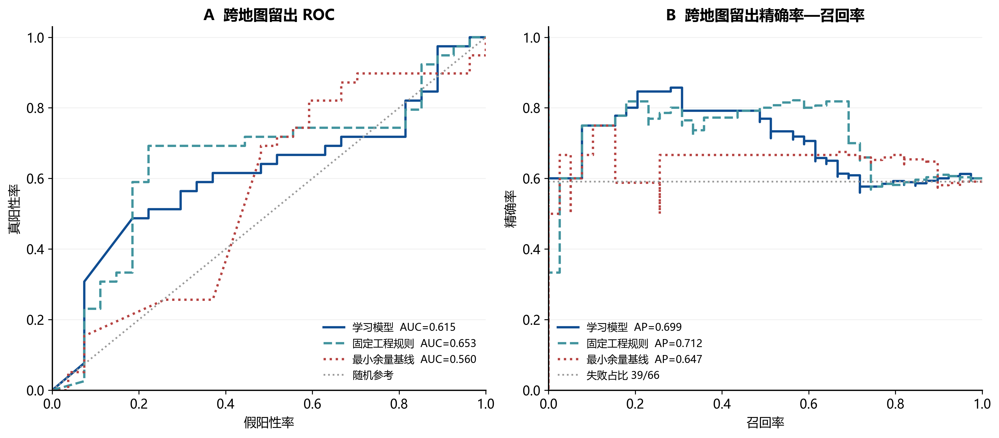
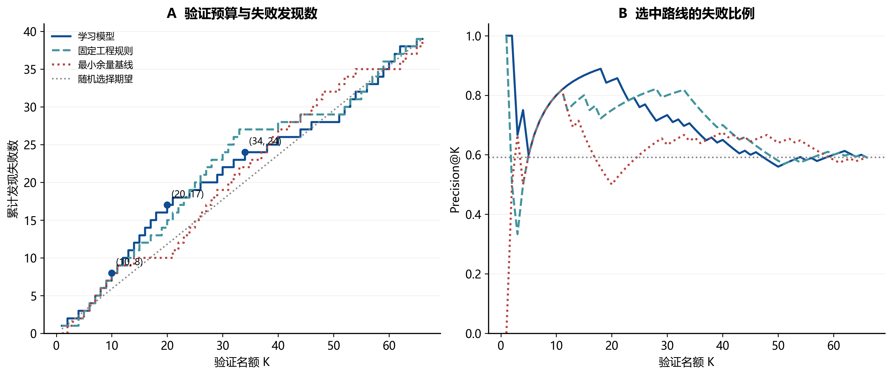
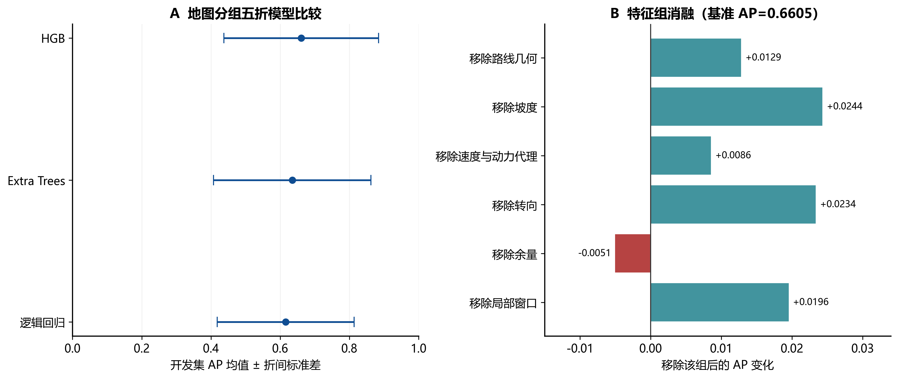
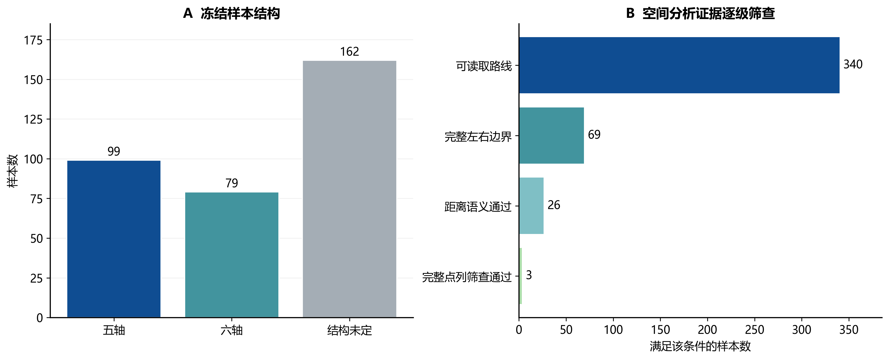
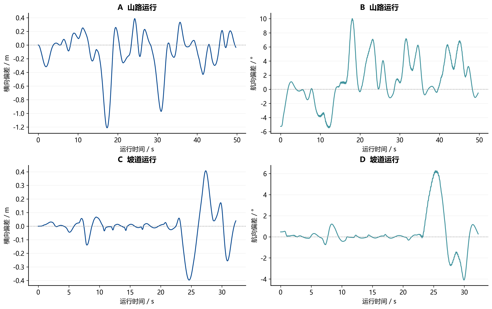
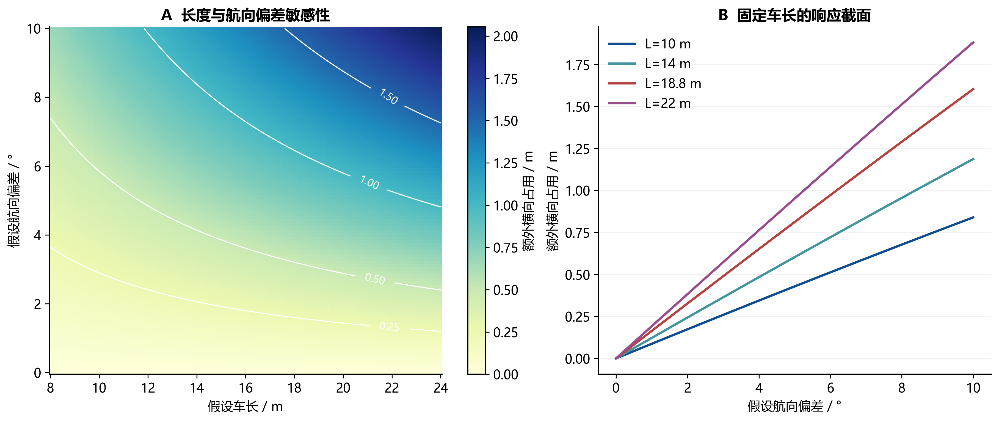
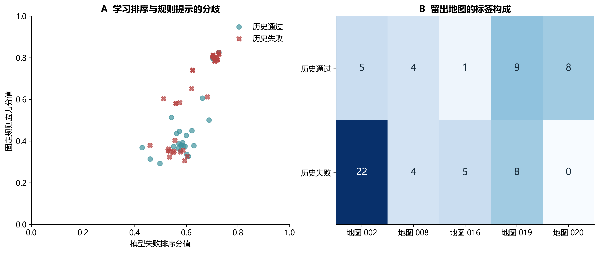

# PathGuard 科研图集与使用建议

共7幅组合图、16个子图。PNG为300 DPI，PDF/SVG适合印刷及编辑。

建议正文优先使用图1、2、5、6；图3、4、7放技术章节或附录，避免用图表数量替代论证。

## 历史留出排序性能

建议位置：第8章 方法比较

66条样本、5张留出地图、39条失败；来自已保存的历史分值。AP采用average_precision_score。曲线为既有结果重绘，不是新增独立验证。

## 有限验证预算的收益曲线

建议位置：第8章 Top-K价值解释

同分按sample_id升序，匹配既有审计口径。蓝色标记为Top-10/20/34。全局留出排序不等于同一规划任务内的批次收益；随机线为解析期望而非一次随机试验。

## 模型选择与特征组消融

建议位置：第8章 消融实验

误差线是5折之间的标准差，不是95%置信区间。消融重新训练模型，正值表示移除该组后均值提高；本结果不支持所有特征组均有独立增益的说法。

## 冻结样本与空间证据覆盖

建议位置：第4章 数据基础 / 技术附录

340条冻结样本可用于路线展示；空间分析需要额外边界条件。69、26、3是嵌套的筛查层次，不能相加；完整点列筛查仍不是连续碰撞检测证明。

## 计划轨迹与实际执行的偏差实录

建议位置：第6章 执行机制 / 第9章 案例

来自两次已核对平台运行的展示序列，曲线经过展示采样，不将采样点当独立试验；全文统计以原始4974/3228帧核查结果为准。平台运行不等同现场实车。

## 长车身为何放大航向偏差

建议位置：第6章 空间机理

解析机理图：刚性矩形、参考点居中、宽3.74 m、横向偏差为0。额外占用=L/2·sinθ+W/2·cosθ−W/2；不含轮胎、载荷或控制动力学，不是道路净空、学习模型风险或真实试验结果。

## 双通道分歧与地图构成

建议位置：第5章 双通道解释 / 第8章 验证背景

每点对应一条历史留出记录，分值相同的点可能重叠。两个轴的分值语义不同，不能据点到对角线距离判断谁正确；右图解释当前评价受到地图构成影响。

