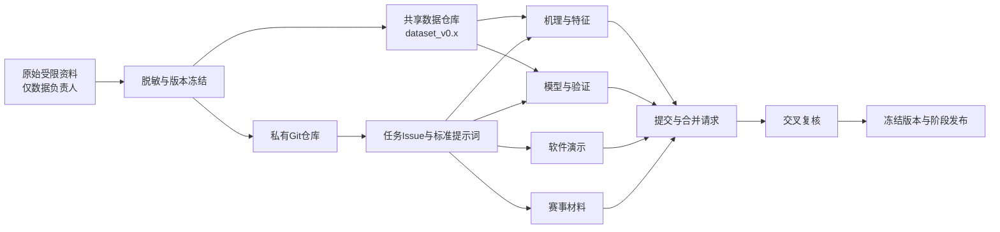

# OnSite赛事项目协作平台共享流程SOP

## 1. 推荐架构

采用两个存储位置：

1. **私有Git平台**：Gitea、GitLab或GitHub Private，用于代码、文档、提示词、任务和评审。
2. **受控数据存储**：NAS、加密共享目录或DVC远端，用于脱敏数据、模型和演示样本。

完整原始工程、路线坐标、专利证据和Codex恢复资料由数据负责人单独保管，不进入普通协作区。



## 2. 平台目录

### Git仓库

```text
onsite-ai-construction/
├─ README.md
├─ CHANGELOG.md
├─ docs/
│  ├─ project_brief.md
│  ├─ data_card.md
│  ├─ evaluation_protocol.md
│  ├─ claims_boundary.md
│  └─ decisions/
├─ prompts/
│  ├─ common_context.md
│  ├─ data_role.md
│  ├─ feature_role.md
│  ├─ model_role.md
│  ├─ demo_role.md
│  └─ proposal_role.md
├─ manifests/
│  ├─ dataset_manifest.csv
│  ├─ split_by_map.csv
│  └─ SHA256SUMS.txt
├─ src/
│  ├─ audit/
│  ├─ features/
│  ├─ models/
│  └─ demo/
├─ configs/
├─ experiments/
│  └─ templates/
├─ reports/
├─ tests/
└─ .gitignore
```

### 数据仓库

```text
onsite-data/
├─ releases/
│  ├─ dataset_v0.1/
│  └─ dataset_v0.2/
├─ review_samples/
├─ local_segments/
├─ demo_samples/
├─ model_artifacts/
└─ restricted_raw/       # 仅数据负责人可见
```

## 3. 人员和权限

| 角色 | Git权限 | 数据权限 | 主要责任 |
|---|---|---|---|
| 项目负责人 | 管理员 | 查看共享包 | 确定范围、优先级和对外口径 |
| A 数据负责人 | 维护者 | 原始区读写、共享区发布 | 脱敏、版本、清单、权限 |
| B 机理特征 | 开发者 | 建模包、局部片段 | 失效机理和局部特征 |
| C 模型验证 | 开发者 | 建模包、预测结果 | 模型、验证、指标审计 |
| D 软件演示 | 开发者 | 演示包、固定模型 | 产品流程和离线演示 |
| E 赛事材料 | 报告者或开发者 | 汇总数据 | 项目书、PPT、答辩和客户共创 |

基本原则：

- `main`分支受保护，只有通过评审的合并请求才能进入。
- 原始数据区默认只有A可见。
- D和E不需要访问原始NPZ及完整比赛工程。
- B、C确需原始片段时，由A按任务导出最小子集。

## 4. 第一次共享流程

### 步骤1：建立项目

项目负责人创建：

- 一个私有仓库；
- 一个任务看板；
- 一个共享数据目录；
- 一个只读原始资料目录。

任务看板设置为：

```text
待分配 → 已分配 → 进行中 → 待复核 → 需修改 → 已完成 → 已冻结
```

### 步骤2：冻结共同口径

A在仓库提交以下文件：

- 项目简介；
- P1/P2/P3报告；
- `data_card.md`；
- `evaluation_protocol.md`；
- `claims_boundary.md`；
- `split_by_map.csv`；
- 数据文件哈希。

当前共同口径应写明：

- 主分析数据为246条独立候选路线、25张地图；
- 测试必须按整张地图留出；
- 173条车型身份缺失记为`unknown`；
- 闭环净空、滑移、轮胎利用率和最终通过结果只能作为标签或分析结果；
- 不得将测试地图标签用于阈值选择。

### 步骤3：发布共享包

A发布两个版本：

#### `team_context_v0.1`

全员可见：

- 项目说明；
- 三阶段报告；
- 汇总、逐地图和分工况指标；
- 失败原因统计；
- 分工及对外表述边界。

#### `dataset_v0.1`

B、C可见：

- 脱敏建模样本；
- 稳定的`sample_id`、`route_id`、`map_id`和`batch_id`；
- 标签、策略和字段字典；
- P2/P3逐样本预测；
- 重点复核样本。

每个数据版本必须同时包含：

```text
README.md
DATA_CARD.md
MANIFEST.csv
SHA256SUMS.txt
CHANGELOG.md
```

### 步骤4：团队确认

每个人只需完成一次确认：

1. 能访问仓库；
2. 能下载授权的数据包；
3. 能运行最小读取脚本；
4. 已阅读数据口径和对外边界；
5. 在自己的第一个Issue中回复所用数据版本。

## 5. 任务下发流程

所有工作都通过Issue下发，不在聊天记录中单独形成无编号任务。

### Issue编号

```text
DATA-xxx   数据、身份和版本
FEAT-xxx   机理和特征
MODEL-xxx  模型与验证
DEMO-xxx   软件和演示
DOC-xxx    项目书、PPT和答辩
REVIEW-xxx 交叉复核
```

### Issue必须填写

```markdown
## 目标

## 输入
- 数据版本：
- 文件：
- 代码版本：

## 允许使用的字段

## 禁止事项

## 输出

## 验收标准

## 截止时间

## 复核人
```

## 6. 提示词共享流程

提示词也作为版本文件管理，不通过私聊反复复制修改。

### 共同提示词

`prompts/common_context.md`只放所有成员都必须遵守的内容：

- 项目目标；
- 数据版本；
- 标签定义；
- 验证方法；
- 禁止数据泄漏规则；
- 对外表述边界；
- 输出目录和命名规范。

### 角色提示词

每个角色的提示词只补充本人的任务：

- A：只整理数据，不训练模型或修改标签；
- B：只使用执行前可获得的信息设计特征；
- C：不得修改地图划分，必须报告最差地图；
- D：使用固定接口和演示数据，不读取原始工程；
- E：不得增加未验证的实车、安全认证或跨车型结论。

### AI结果记录

使用AI完成的任务需要在提交说明中记录：

```text
使用工具/模型：
提示词版本：
数据版本：
人工修改内容：
验证方式：
```

不要把原始NPZ、完整路线、专利实现或密钥上传到未批准的AI服务。

## 7. 每个人的工作流程

1. 从看板领取Issue。
2. 在Issue中确认输入版本。
3. 建立分支：`角色/Issue编号-短名称`。
4. 只在自己的分支修改。
5. 实验结果放入独立目录，不覆盖他人的输出。
6. 运行规定的验证。
7. 提交合并请求。
8. 由指定复核人检查。
9. 修改完成后合并到`main`。
10. 看板移至“已完成”；进入阶段版本后再移至“已冻结”。

分支示例：

```text
data/DATA-003-recover-profile-id
feature/FEAT-002-ramp-local-window
model/MODEL-004-map-holdout-calibration
demo/DEMO-002-risk-review-page
docs/DOC-003-project-proposal
```

## 8. 模型实验提交规范

每次实验建立一个目录：

```text
experiments/MODEL-004_20260918/
├─ README.md
├─ config.json
├─ metrics.json
├─ per_map_metrics.csv
├─ predictions.csv
├─ error_cases.csv
└─ environment.txt
```

`README.md`必须说明：

- 使用的数据版本；
- 训练特征；
- 外层和内层划分；
- 与固定余量的对照；
- 总体失败召回；
- 通过保留率；
- 最差地图失败召回；
- 拒判率；
- 已知限制。

没有逐地图指标和误放清单的实验不得进入项目书。

## 9. 合并请求复核

### 数据修改

由A和C共同复核：

- 是否改变样本数和标签；
- 是否产生重复或冲突；
- 是否改变地图分组；
- 是否更新数据版本和哈希。

### 特征修改

由B和C交叉复核：

- 是否为执行前可获得信息；
- 是否包含标签泄漏；
- 单位和物理含义是否明确；
- 是否能够重复提取。

### 模型修改

由B或A复核：

- 是否保持整图留出；
- 阈值是否只由训练地图确定；
- 是否报告最差地图；
- 是否保留完整预测表。

### 演示和材料

由C和项目负责人复核：

- 页面数字是否来自冻结指标；
- 是否隐藏内部路径和敏感信息；
- 是否存在超出证据的宣传。

## 10. 每日同步

不需要长会。每天在固定Issue或群公告中更新一次：

```text
昨日完成：
今日计划：
使用版本：
新增输出：
阻塞问题：
需要谁复核：
```

建议每两天安排一次20分钟同步，只讨论：

- 数据版本变化；
- 阻塞项；
- 结论变化；
- 需要跨角色交付的接口。

## 11. 阶段发布

### `v0.1-team-start`

- P1—P3报告；
- 数据字典；
- 246条脱敏数据；
- 当前基线；
- 角色任务和提示词。

### `v0.2-local-features`

- 车型身份恢复结果；
- `ramp_1/ramp_6/cliff_1`局部特征；
- 更新后的整图留出结果。

### `v0.3-demo`

- 固定推理接口；
- 演示样本；
- 风险解释和拒判页面；
- 可复现安装说明。

### `v1.0-submission`

- 项目书；
- 答辩PPT；
- 演示包；
- 最终指标；
- 对外共享审计清单。

每个发布版本必须打Git标签，同时冻结对应数据版本和哈希。

## 12. 出现冲突时的处理

- 两人得到不同结论：先检查数据版本、地图划分和阈值来源，不用投票决定。
- 同一文件多人修改：由文件负责人整合，其他人通过合并请求提交。
- 需要新增数据：先提交`DATA` Issue，由A发布新版本，禁止私下替换旧文件。
- 指标变差：保留结果和失败样本，不删除实验记录。
- 发现数据泄漏：立即将相关结论标为无效，从最近冻结版本重新运行。
- 对外资料引用未冻结数字：退回修改，不进入最终包。

## 13. 第一天可直接执行的清单

1. 创建私有仓库和任务看板。
2. 添加4—5名成员并设置权限。
3. 上传P1/P2/P3报告、分工方案和共同提示词。
4. A创建`DATA-001：生成team_context_v0.1`。
5. A创建`DATA-002：生成dataset_v0.1`。
6. B创建`FEAT-001：ramp_1局部净空失效分析`。
7. C创建`MODEL-001：复现P2/P3冻结基线`。
8. D创建`DEMO-001：定义风险分析输入输出接口`。
9. E创建`DOC-001：项目书结构与证据映射`。
10. 全员在各自Issue中确认数据版本和交付时间。

完成以上十项后，团队即可正式并行。
